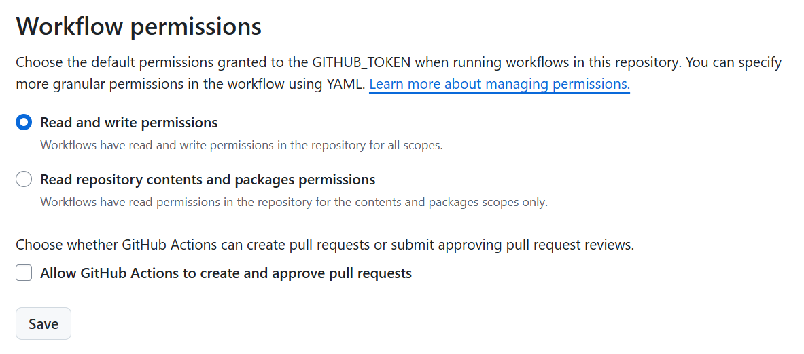

<a id="T_6d3d"></a>

# Weather\-git\-scraping

GitHub Actions used to scrape the weather️ 


<!-- Begin Toc -->

## Table of Contents
&emsp;&emsp;[Initialize](#H_7220)
 
&emsp;&emsp;[Iterate](#H_9a57)
 
&emsp;&emsp;[Automate](#H_3b18)
 
&emsp;&emsp;[Settings](#H_46de)
 
&emsp;&emsp;[Utils](#H_9217)
 
<!-- End Toc -->
<a id="H_7220"></a>

## Initialize
```matlab
apikey = getenv("OWM_KEY");
% T = getWeather(apikey);
% writetable(T,"weather_boston.csv")
```
<a id="H_9a57"></a>

## Iterate
```matlab
T = readtable("weather_boston.csv");
T2 = getWeather(apikey);
T = [T;T2]
```


| |temp|feels_like|temp_min|temp_max|pressure|humidity|sea_level|grnd_level|time|
|:--:|:--:|:--:|:--:|:--:|:--:|:--:|:--:|:--:|:--:|
|1|76.9500|76.8400|74.2500|79.5000|1011|53|1011|1007|21-Jul-2025 16:17:22|
|2|76.8400|76.6600|74.2500|79.0700|1011|52|1011|1007|21-Jul-2025 16:38:15|


```matlab
writetable(T,"weather_boston.csv")
```
<a id="H_3b18"></a>

## Automate

Create [.github/workflows/scraper.yml](.github/workflows/scraper.yml)

```
name: weather scraper
on:
  schedule:
    - cron: '*/5 * * * *'
  workflow_dispatch:
jobs:
  git-scraping:
    runs-on: ubuntu-latest
    steps:
      - uses: actions/checkout@v4.2.2
      - name: Setup MATLAB
        uses: matlab-actions/setup-matlab@v2.5.0
        with:
          release: R2025a
      - name: Run MATLAB live script
        uses: matlab-actions/run-command@v2.2.1
        with:
          # Script, function, or statement to execute
          command: weatherscraper
          
      - name: Upload an Artifact
        uses: actions/upload-artifact@v4.6.2
        with:
          # Artifact name
          name: weather-boston
          path: weather_boston.csv
          
      - name: Commit and push if it changed
        run: |
          git config user.name "github-actions[bot]"
          git config user.email "actions@users.noreply.github.com"
          git add -A
          timestamp=$(date -u)
          git commit -m "Latest data: ${timestamp}" || exit 0
            git push
env:
  OWM_KEY: ${{secrets.OWM_KEY}}
```
<a id="H_46de"></a>

## Settings

Make sure to grant read AND write workflow permissions to the Actions in the repo settings:




<a id="H_9217"></a>

## Utils
```matlab
function T = getWeather(apikey)
url = "https://api.openweathermap.org/data/2.5/weather?q=Boston&units=imperial&appid="+apikey;
data = webread(url,weboptions(Timeout=10));
weather = data.main;
weather.time = datetime(data.dt,"ConvertFrom","posixtime");
T = struct2table(weather);
end
```

Don't forget to [add badge to Open in MATLAB Online](https://www.mathworks.com/products/matlab-online/git.html)


`[](https://matlab.mathworks.com/open/github/v1?repo=yanndebray/git-scraping101&file=weatherscraper.mlx)`

```matlab
export weatherscraper.mlx README.md;
```
